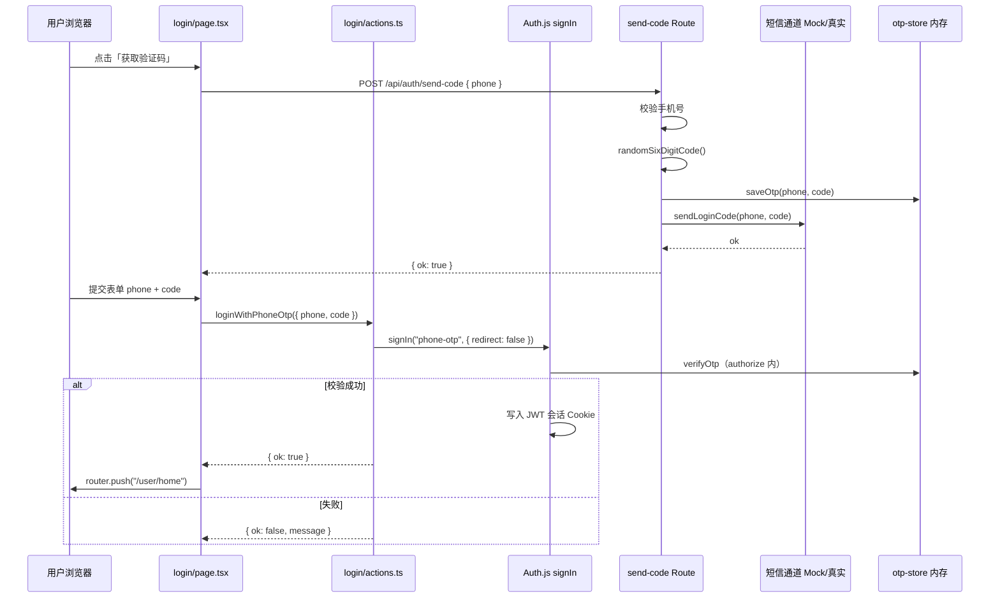

# 手机号 + 短信验证码登录：学习与实现流程（my-book-app 已实现）

> **说明**：本文档与仓库**当前实现**对齐，技术栈为 `Next.js 16`（App Router）、`React 19`、`next-auth@5.0.0-beta.31`（Auth.js v5）、`Drizzle ORM`、`Postgres`。  
> 登录页：`src/app/(page)/user/(auth)/login/page.tsx`；会话由 Auth.js 管理，验证码校验在 `src/auth.ts` 的 `Credentials` 提供商中完成。

---

## 目录

1. [你要实现的是什么](#1-你要实现的是什么)
2. [核心概念（第一次做必读）](#2-核心概念第一次做必读)
3. [端到端流程总览（当前实现）](#3-端到端流程总览当前实现)
4. [安全与风控（避免踩坑）](#4-安全与风控避免踩坑)
5. [开发环境 vs 生产环境：如何「模拟验证码」又方便替换](#5-开发环境-vs-生产环境如何模拟验证码又方便替换)
6. [项目内文件划分（当前）](#6-项目内文件划分当前)
7. [短信通道抽象（Mock / 真实厂商）](#7-短信通道抽象mock--真实厂商)
8. [验证码生成、存储与校验](#8-验证码生成存储与校验)
9. [API（Route Handlers）](#9-apiroute-handlers)
10. [登录态（Auth.js / next-auth v5）](#10-登录态authjs--next-auth-v5)
11. [登录页 UI 与 Server Action](#11-登录页-ui-与-server-action)
12. [可选：用数据库持久化验证码与会话](#12-可选用数据库持久化验证码与会话)
13. [自测清单](#13-自测清单)
14. [附录：文件对照表](#14-附录文件对照表)

---

## 1. 你要实现的是什么

**目标**：用户输入中国大陆手机号 → 点击「获取验证码」→ 收到 6 位数字短信（开发环境可看终端日志）→ 输入验证码 → 登录成功（若手机号首次出现则等价于注册）。

**典型拆分**：

| 步骤 | 谁来做 | 产物 |
|------|--------|------|
| 校验手机号格式 | 前端 + 后端都要做 | 减少无效请求 |
| 生成 6 位验证码 | 仅后端 | 随机数，不可预测 |
| 发送短信 | 仅后端（调用短信厂商 API） | 用户手机收到短信 |
| 暂存验证码与过期时间 | 仅后端 | 当前为内存 Map（多实例生产需 Redis） |
| 校验验证码 + 建立会话 | Auth.js `authorize` | 校验通过后写入会话 Cookie |
| 后续请求识别用户 | `auth()` / `useSession()` | 服务端或客户端读取会话 |

---

## 2. 核心概念（第一次做必读）

### 2.1 为什么验证码绝不能只存在前端

前端代码对用户是可见、可篡改的。若只在浏览器里生成验证码，攻击者可以伪造「验证通过」并直接进入系统。**验证码生成、存储、比对必须在服务端完成**。

### 2.2 「发短信」和「登录」为什么要分成两步

- **发送验证码**（`POST /api/auth/send-code`）：高频、易被刷，需要限流、人机验证（生产建议）、IP 限制等。  
- **校验并登录**（`signIn("phone-otp", …)` via Server Action）：校验通过后才创建 Auth.js 会话；失败使用统一文案。

当前登录页**不**直接调用 `/api/auth/verify-code`，避免验证码被消费两次。

### 2.3 会话：本项目使用 Auth.js v5 + JWT

- 配置 `session: { strategy: "jwt" }`。  
- `authorize` 校验 OTP 成功后返回 `{ id, phone }`，Auth.js 签发 Cookie。  
- `callbacks.jwt` / `callbacks.session` 把 `phone` 写入 token 与 session（见 `src/auth.ts`、`src/types/next-auth.d.ts`）。

### 2.4 开发环境「模拟短信」

`SMS_PROVIDER=mock` 时，`MockSmsSender` 在 `SMS_MOCK_LOG_CODE=true` 时把验证码打到服务端终端，**不调用真实短信网关**。生产改为真实厂商实现即可。

---

## 3. 端到端流程总览（当前实现）



---

## 4. 安全与风控（避免踩坑）

1. **限流**：`send-code` 中 `allowSend` 已预留但**当前注释未启用**（见 `src/app/api/auth/send-code/route.ts`），上线前建议打开 `src/lib/auth/rate-limit.ts` 或等价方案。  
2. **验证码有效期**：5 分钟（`otp-store.ts` 中 `TTL_MS`）。  
3. **验证次数上限**：同一 OTP 错误 5 次作废（`MAX_ATTEMPTS`）。  
4. **错误提示统一**：登录失败为「验证码错误或已过期」。  
5. **`AUTH_SECRET` 必填**：未配置会报 `MissingSecret`（见第 10.2 节）。  
6. **生产不要用 JSON 返回明文验证码**（仅 `SMS_EXPOSE_DEBUG_CODE=true` 且 development 时可返回 `debugCode`）。

---

## 5. 开发环境 vs 生产环境：如何「模拟验证码」又方便替换

### 5.1 环境变量（与 `.env.example` 一致）

```bash
DATABASE_URL='数据库连接串'

# Auth.js v5 必填
AUTH_SECRET='用 openssl rand -base64 32 生成'
AUTH_URL='http://localhost:3000'

NEXT_PUBLIC_APP_ENV='development | preview | production'
NEXT_PUBLIC_SITE_URL='网站URL'

# 短信
SMS_PROVIDER='mock'
SMS_MOCK_LOG_CODE='true'
# SMS_EXPOSE_DEBUG_CODE='true'  # 可选：接口 JSON 返回 debugCode（仅 development）

# 生产厂商（占位）
# SMS_ACCESS_KEY_ID=''
# SMS_ACCESS_KEY_SECRET=''
# SMS_SIGN_NAME=''
# SMS_TEMPLATE_CODE=''
```

修改 `.env.local` 后需**重启** `pnpm dev`，Next.js 才会加载新变量。

### 5.2 Mock 行为

- `SMS_PROVIDER=mock`：`MockSmsSender` 在 `SMS_MOCK_LOG_CODE=true` 时 `console.info` 打印 `[SMS MOCK] phone=... code=...`。  
- 生产环境禁止 `SMS_PROVIDER=mock`（可在 `getSmsSender` 或启动时断言）。

---

## 6. 项目内文件划分（当前）

```text
src/
  auth.ts                                      # Auth.js v5：handlers, auth, signIn, signOut
  types/next-auth.d.ts                         # Session / JWT 扩展 phone 字段
  lib/auth/
    phone.ts
    otp.ts
    otp-store.ts
    sms/
      types.ts
      mock-sms.ts
      real-sms.ts
      index.ts
  app/
    layout.tsx                                 # await auth() + AuthSessionProvider
    api/auth/
      send-code/route.ts
      verify-code/route.ts                     # 可选/调试；登录 UI 不调用
      [...nextauth]/route.ts                   # export { GET, POST } = handlers
  app/(page)/user/(auth)/login/
    page.tsx                                   # 客户端表单 + 发码 fetch
    actions.ts                                 # Server Action：loginWithPhoneOtp
  components/providers/
    session-provider.tsx                       # next-auth/react SessionProvider
```

---

## 7. 短信通道抽象（Mock / 真实厂商）

实现位于 `src/lib/auth/sms/`，业务只依赖 `getSmsSender()`：

- `types.ts`：`SmsSender` 接口  
- `mock-sms.ts`：开发 Mock  
- `real-sms.ts`：生产厂商占位  
- `index.ts`：按 `SMS_PROVIDER` 选择实现  

---

## 8. 验证码生成、存储与校验

| 文件 | 作用 |
|------|------|
| `src/lib/auth/otp.ts` | `randomSixDigitCode()` |
| `src/lib/auth/phone.ts` | `isCnMobile`、`normalizePhone` |
| `src/lib/auth/otp-store.ts` | 内存 `Map`，TTL 5 分钟，最多 5 次错误 |

**注意**：多实例部署时内存 Map 不一致，生产应换 **Redis** 或数据库。

---

## 9. API（Route Handlers）

### 9.1 `POST /api/auth/send-code`

路径：`src/app/api/auth/send-code/route.ts`

流程：校验手机号 → 生成验证码 → `saveOtp` → `getSmsSender().sendLoginCode` → 返回 `{ ok: true }`（可选 `debugCode`）。

前端在 `login/page.tsx` 的 `sendCode` 中调用，需设置：

```typescript
headers: { "Content-Type": "application/json" }
```

### 9.2 `POST /api/auth/verify-code`（可选）

路径：`src/app/api/auth/verify-code/route.ts`

仅校验 OTP 并返回 `{ ok: true }`，**不建立会话**。

当前登录流程走 Auth.js `signIn`，会在 `authorize` 里再次调用 `verifyOtp`。因此：

- **不要**在已调用 `verify-code` 后再 `signIn`，否则验证码已被删除会导致登录失败。  
- 该路由可保留用于 Postman 调试或后续纯 API 场景；正式登录以 Server Action 为准。

### 9.3 限流（待启用）

文档示例中的 `src/lib/auth/rate-limit.ts` 尚未加入仓库；`send-code` 内相关调用已注释，可按需补上。

---

## 10. 登录态（Auth.js / next-auth v5）

### 10.1 依赖版本

```json
"next-auth": "5.0.0-beta.31"
```

安装：

```bash
pnpm add next-auth@5.0.0-beta.31
```

### 10.2 环境变量

| 变量 | 说明 |
|------|------|
| `AUTH_SECRET` | **必填**，用于签名会话；缺失会报 `[auth][error] MissingSecret` |
| `AUTH_URL` | 本地建议 `http://localhost:3000` |

v5 不再在配置里使用 `trustHost` 字段；通过 `AUTH_URL` 等环境变量即可。

### 10.3 `src/auth.ts`

```typescript
import NextAuth from "next-auth"
import Credentials from "next-auth/providers/credentials"
import { verifyOtp } from "@/lib/auth/otp-store"
import { isCnMobile, normalizePhone } from "@/lib/auth/phone"

export const { handlers, auth, signIn, signOut } = NextAuth({
  secret: process.env.AUTH_SECRET,
  providers: [
    Credentials({
      id: "phone-otp",
      name: "手机号验证码登录",
      credentials: {
        phone: { label: "手机号", type: "text" },
        code: { label: "验证码", type: "text" },
      },
      async authorize(credentials) {
        const phone = normalizePhone(String(credentials?.phone ?? ""))
        const code = String(credentials?.code ?? "").trim()
        if (!isCnMobile(phone) || !/^\d{6}$/.test(code)) return null

        const result = verifyOtp(phone, code)
        if (result !== "ok") return null

        // TODO: 查找或创建用户（Drizzle user 表）
        return { id: phone, phone }
      },
    }),
  ],
  pages: { signIn: "/user/login" },
  session: { strategy: "jwt" },
  callbacks: {
    jwt({ token, user }) {
      if (user?.phone) token.phone = user.phone
      return token
    },
    session({ session, token }) {
      if (session.user && token.phone) {
        session.user.phone = token.phone as string
      }
      return session
    },
  },
})
```

### 10.4 `src/app/api/auth/[...nextauth]/route.ts`

```typescript
import { handlers } from "@/auth"

export const { GET, POST } = handlers
```

### 10.5 根布局注入会话：`src/app/layout.tsx`

```typescript
import { auth } from "@/auth"
import { AuthSessionProvider } from "@/components/providers/session-provider"

export default async function RootLayout({ children }) {
  const session = await auth()
  return (
    <html lang="zh-CN">
      <body>
        <AuthSessionProvider session={session}>
          {children}
        </AuthSessionProvider>
      </body>
    </html>
  )
}
```

### 10.6 `src/components/providers/session-provider.tsx`

客户端包装 `next-auth/react` 的 `SessionProvider`，并传入服务端 `session`，避免客户端首次请求闪烁。

### 10.7 类型扩展：`src/types/next-auth.d.ts`

为 `User`、`Session`、`JWT` 增加可选字段 `phone`。

### 10.8 服务端读取会话

```typescript
import { auth } from "@/auth"

const session = await auth()
// session?.user?.phone
```

客户端（需 `"use client"`）：

```typescript
import { useSession } from "next-auth/react"
```

---

## 11. 登录页 UI 与 Server Action

### 11.1 当前页面行为

路径：`src/app/(page)/user/(auth)/login/page.tsx`

| 能力 | 实现 |
|------|------|
| 表单校验 | `react-hook-form` + `zod`（11 位手机、6 位验证码） |
| 获取验证码 | `fetch("/api/auth/send-code")`，60s 前端倒计时 |
| 登录 | `onSubmit` → `loginWithPhoneOtp`（Server Action） |
| 成功跳转 | `router.push("/user/home")` + `router.refresh()` |
| 防原生提交 | `<form onSubmit={form.handleSubmit(onSubmit)}>`，按钮 `type="submit"` |

**常见坑**：登录按钮若未放在 `onSubmit` 里且默认为 `submit`，会触发 GET 表单提交，URL 变成 `/user/login?phone=...&code=...`。

### 11.2 Server Action：`login/actions.ts`

v5 推荐在服务端调用 `signIn`（从 `@/auth` 导入，而非 `next-auth/react`）：

```typescript
"use server"

import { signIn } from "@/auth"

export async function loginWithPhoneOtp(input: {
  phone: string
  code: string
}): Promise<{ ok: true } | { ok: false; message: string }> {
  try {
    const result = await signIn("phone-otp", {
      phone: input.phone,
      code: input.code,
      redirect: false,
    })

    if (result && typeof result === "object" && "error" in result) {
      return {
        ok: false,
        message:
          result.error === "CredentialsSignin"
            ? "验证码错误或已过期"
            : "登录失败，请稍后重试",
      }
    }

    return { ok: true }
  } catch (error: unknown) {
    // Auth.js 可能抛出带 type 的错误；勿依赖 next-auth 具名导出 AuthError（IDE/v4 类型可能不一致）
    if (
      error &&
      typeof error === "object" &&
      "type" in error &&
      (error as { type?: string }).type === "CredentialsSignin"
    ) {
      return { ok: false, message: "验证码错误或已过期" }
    }
    throw error
  }
}
```

页面侧：

```typescript
const result = await loginWithPhoneOtp({ phone: data.phone, code: data.code })
if (result.ok) {
  router.push("/user/home")
  router.refresh()
} else {
  form.setError("root", { message: result.message })
}
```

### 11.3 与旧示例的差异

| 旧文档示例 | 当前项目 |
|------------|----------|
| 客户端 `signIn` from `next-auth/react` | Server Action 内 `signIn` from `@/auth` |
| 密码登录 UI | 验证码登录 + shadcn `Form` / `Input` |
| 登录后 `window.location.href` | `useRouter().push` + `refresh` |
| 单独调用 `verify-code` 再跳转 | 仅 `signIn` 内校验 OTP |

---

## 12. 可选：用数据库持久化验证码与会话

项目已具备 Drizzle + Postgres，可新增 `phone_otp` 表（建议存 `code_hash`）及 `user` 表，在 `authorize` 中「查找或创建用户」后返回真实 `user.id`。

建议顺序：**内存 OTP 已跑通** → Redis OTP → 用户表 + 会话字段扩展。

---

## 13. 自测清单

1. `.env.local` 已配置 `AUTH_SECRET`、`AUTH_URL`，且已重启 dev server。  
2. 错误手机号：前后端均拒绝。  
3. `SMS_MOCK_LOG_CODE=true` 时，发码后终端能看到 `[SMS MOCK]`。  
4. 正确验证码：登录成功并跳转 `/user/home`；刷新后 `await auth()` 仍有 session。  
5. 错误/过期验证码：页面显示「验证码错误或已过期」，且 URL **不会**出现 `?phone=&code=`。  
6. 连续发码：前端 60s 冷却；后端限流启用后再测 429。  
7. 生产：`SMS_PROVIDER` 非 mock，且关闭 `debugCode` 响应。

---

## 14. 附录：文件对照表

| 概念 | 路径 |
|------|------|
| Auth.js 配置 | `src/auth.ts` |
| Auth Route Handler | `src/app/api/auth/[...nextauth]/route.ts` |
| 发送验证码 | `src/app/api/auth/send-code/route.ts` |
| 仅校验 OTP（可选） | `src/app/api/auth/verify-code/route.ts` |
| 登录页 | `src/app/(page)/user/(auth)/login/page.tsx` |
| 登录 Server Action | `src/app/(page)/user/(auth)/login/actions.ts` |
| Session Provider | `src/components/providers/session-provider.tsx` |
| 根布局会话 | `src/app/layout.tsx` |
| Session 类型扩展 | `src/types/next-auth.d.ts` |
| 环境变量示例 | `.env.example` |
| 依赖版本 | `package.json` → `next-auth@5.0.0-beta.31` |

---

**结语**：当前仓库已完成 **Mock 短信 + 内存 OTP + send-code API + Auth.js v5 会话 + 登录页 Server Action**。后续优先：启用 send-code 限流、接入真实短信、`authorize` 内对接 Drizzle 用户表、按需增加 Middleware 保护 `/user/*` 路由。
