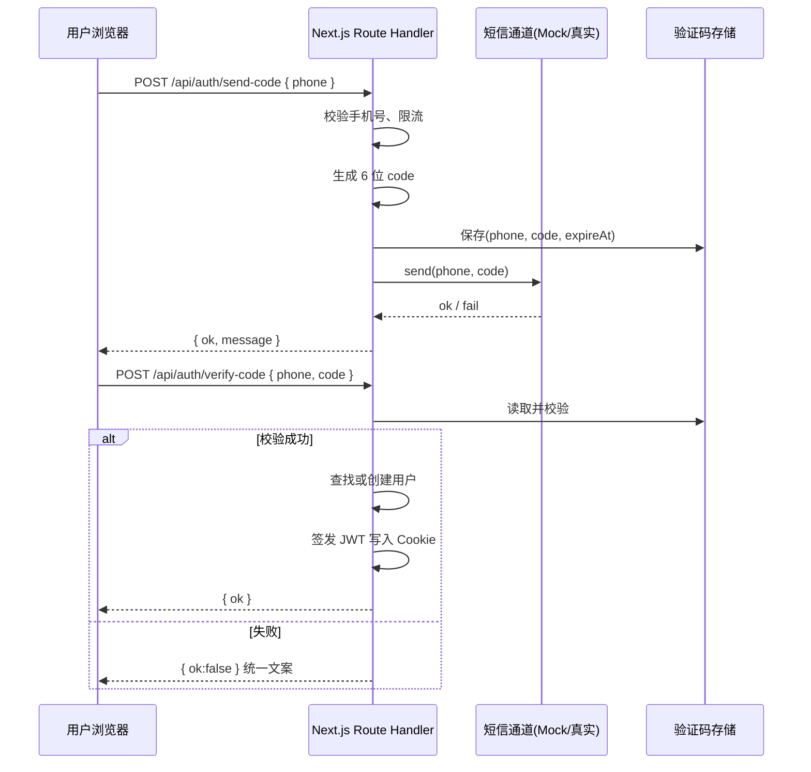

# 手机号 + 短信验证码登录：学习与实现流程（结合 my-book-app）

> **说明**：本文档用于学习与规划，**不直接修改**仓库内现有业务代码。当前项目的用户登录页为  
> `src/app/(page)/user/(auth)/login/page.tsx`（下文以此页为「要改造的 UI 蓝本」）。  
> 技术栈参考：`Next.js 16`（App Router）、`React 19`、`Drizzle ORM`、`Postgres`（见 `package.json`）。

---

## 目录

1. [你要实现的是什么](#1-你要实现的是什么)
2. [核心概念（第一次做必读）](#2-核心概念第一次做必读)
3. [端到端流程总览](#3-端到端流程总览)
4. [安全与风控（避免踩坑）](#4-安全与风控避免踩坑)
5. [开发环境 vs 生产环境：如何「模拟验证码」又方便替换](#5-开发环境-vs-生产环境如何模拟验证码又方便替换)
6. [推荐的项目内文件划分](#6-推荐的项目内文件划分)
7. [可复制的代码：短信通道抽象（Mock / 真实厂商）](#7-可复制的代码短信通道抽象mock--真实厂商)
8. [可复制的代码：验证码生成、存储与校验](#8-可复制的代码验证码生成存储与校验)
9. [可复制的代码：API（Route Handlers）](#9-可复制的代码apiroute-handlers)
10. [可复制的代码：登录态（Cookie + JWT 思路）](#10-可复制的代码登录态cookie--jwt-思路)
11. [UI：以当前 `user/login` 为改造目标](#11-ui以当前-userlogin-为改造目标)
12. [可选：用数据库持久化验证码与会话](#12-可选用数据库持久化验证码与会话)
13. [自测清单](#13-自测清单)

---

## 1. 你要实现的是什么

**目标**：用户输入中国大陆手机号 → 点击「获取验证码」→ 收到 6 位数字短信 → 输入验证码 → 登录成功（若手机号首次出现则等价于注册）。

**典型拆分**：

| 步骤 | 谁来做 | 产物 |
|------|--------|------|
| 校验手机号格式 | 前端 + 后端都要做 | 减少无效请求 |
| 生成 6 位验证码 | 仅后端 | 随机数，不可预测 |
| 发送短信 | 仅后端（调用短信厂商 API） | 用户手机收到短信 |
| 暂存验证码与过期时间 | 仅后端 | Redis / 数据库 / 内存（仅开发） |
| 校验验证码 | 仅后端 | 比对、删除或作废 |
| 建立登录态 | 仅后端写 Cookie 或返回 Token | 后续请求可识别用户 |

---

## 2. 核心概念（第一次做必读）

### 2.1 为什么验证码绝不能只存在前端

前端代码对用户是可见、可篡改的。若只在浏览器里生成验证码，攻击者可以伪造「验证通过」并直接进入系统。**验证码生成、存储、比对必须在服务端完成**。

### 2.2 「发短信」和「登录」为什么要分成两个接口

- **发送验证码**：高频、易被刷，需要限流、图形验证码/人机验证（生产强烈建议）、IP 限制等。  
- **校验并登录**：校验通过后才创建会话，失败不应泄露「用户是否存在」等敏感信息（见第 4 节）。

### 2.3 会话（Session）常见两种做法

1. **Cookie 里存 JWT**：服务端用 `AUTH_SECRET` 签名，浏览器自动带 Cookie，适合 BFF（本项目已有 `AUTH_SECRET` 占位，见 `.env.example`）。  
2. **服务端 Session + Cookie 只存 Session ID**：Session 数据在 Redis，可立即吊销，更安全但运维成本高。

学习阶段可先掌握 **JWT + HttpOnly Cookie**。

### 2.4 开发环境「模拟短信」到底是什么

不是「跳过安全」，而是：**不调用真实短信网关**，把「应当发到手机里的验证码」用可观测的方式呈现出来，例如：

- 打印在服务端终端日志；或  
- 在接口 JSON 里仅在 `development` 返回 `debugCode`（仅本地，切勿在生产开启）。

生产环境把 `SMS_PROVIDER` 换成真实实现即可，**业务代码（Controller / Route Handler）不感知厂商差异**。

---

## 3. 端到端流程总览



---

## 4. 安全与风控（避免踩坑）

1. **限流**：同一手机号、同一 IP 在 60 秒内只能发 1 次；每天上限（例如 10 次）。  
2. **验证码有效期**：常见 5 分钟；过期删除。  
3. **验证次数上限**：同一验证码错误 5 次则作废，需重新获取。  
4. **错误提示统一**：登录失败时尽量用「手机号或验证码错误」，避免被用来遍历「哪些手机号已注册」。  
5. **HTTPS**：生产全站 HTTPS，防中间人窃听 Cookie。  
6. **Cookie 属性**：`HttpOnly`、`Secure`（生产）、`SameSite=Lax` 或 `Strict`（按跨站需求）。  
7. **生产不要用 JSON 返回明文验证码**。

---

## 5. 开发环境 vs 生产环境：如何「模拟验证码」又方便替换

### 5.1 环境变量约定（可与现有 `.env.example` 对齐扩展）

在 `.env.example` 基础上可增加（示例名，实现时自行取舍）：

```bash
# 已有
AUTH_SECRET='鉴权密钥'
NEXT_PUBLIC_APP_ENV='development | preview | production'

# 建议新增（短信）
SMS_PROVIDER='mock' # development 用 mock；production 改为 aliyun | tencent | 等
SMS_MOCK_LOG_CODE='true' # 是否在服务端日志打印验证码

# 生产接入某厂商时（示例占位）
# SMS_ACCESS_KEY_ID=''
# SMS_ACCESS_KEY_SECRET=''
# SMS_SIGN_NAME=''
# SMS_TEMPLATE_CODE=''
```

**切换规则（学习用伪代码）**：

```ts
const provider = process.env.SMS_PROVIDER ?? "mock"

if (process.env.NODE_ENV === "production" && provider === "mock") {
  throw new Error("生产环境禁止 SMS_PROVIDER=mock")
}
```

### 5.2 Mock 行为建议

- `SMS_PROVIDER=mock` 时：`console.info` 打印 `[SMS MOCK] phone=... code=...`。  
- 可选：仅在 `NEXT_PUBLIC_APP_ENV=development` 时，接口响应附带 `debugCode`（见下文 API 示例，**默认关闭**）。

---

## 6. 推荐的项目内文件划分

以下为**建议路径**（实施时按需微调，与本文档一致即可）：

```text
src/
  lib/
    auth/
      phone.ts              # 手机号规范化与校验
      otp.ts                # 生成 6 位数字
      otp-store.ts          # 内存版存储（仅开发）或封装 Redis/DB
      sms/
        types.ts            # SmsSender 接口
        mock-sms.ts
        real-sms.ts         # 生产厂商 SDK 封装（阿里云/腾讯云等）
        index.ts            # 根据 SMS_PROVIDER 导出实例
  app/
    api/
      auth/
        send-code/route.ts
        verify-code/route.ts
  app/(page)/user/(auth)/login/
    page.tsx                # 可拆出 LoginForm 客户端组件
```

---

## 7. 可复制的代码：短信通道抽象（Mock / 真实厂商）

### 7.1 接口定义 `src/lib/auth/sms/types.ts`

```typescript
export type SendSmsResult =
  | { ok: true }
  | { ok: false; message: string }

export interface SmsSender {
  sendLoginCode(phone: string, code: string): Promise<SendSmsResult>
}
```

### 7.2 Mock 实现 `src/lib/auth/sms/mock-sms.ts`

```typescript
import type { SmsSender, SendSmsResult } from "./types"

export class MockSmsSender implements SmsSender {
  async sendLoginCode(phone: string, code: string): Promise<SendSmsResult> {
    const shouldLog = process.env.SMS_MOCK_LOG_CODE === "true"
    if (shouldLog) {
      // 仅在开发机终端可见；不要把 code 返回给前端生产环境
      console.info(`[SMS MOCK] phone=${phone} code=${code}`)
    }
    return { ok: true }
  }
}
```

### 7.3 真实厂商占位 `src/lib/auth/sms/real-sms.ts`

```typescript
import type { SmsSender, SendSmsResult } from "./types"

/**
 * 生产环境在此调用具体厂商 HTTP/SDK。
 * 不同厂商参数不同，保持「对外只有 sendLoginCode」即可便于替换。
 */
export class RealSmsSender implements SmsSender {
  async sendLoginCode(phone: string, code: string): Promise<SendSmsResult> {
    // TODO: 调用阿里云 / 腾讯云 / 创蓝 等
    void phone
    void code
    return { ok: false, message: "SMS provider not configured" }
  }
}
```

### 7.4 工厂 `src/lib/auth/sms/index.ts`

```typescript
import { MockSmsSender } from "./mock-sms"
import { RealSmsSender } from "./real-sms"
import type { SmsSender } from "./types"

export function getSmsSender(): SmsSender {
  const provider = process.env.SMS_PROVIDER ?? "mock"
  if (provider === "mock") return new MockSmsSender()
  return new RealSmsSender()
}
```

**学习要点**：业务只依赖 `SmsSender`，换厂商时主要改 `RealSmsSender` 与环境变量。

---

## 8. 可复制的代码：验证码生成、存储与校验

### 8.1 生成 6 位数字 `src/lib/auth/otp.ts`

```typescript
export function randomSixDigitCode(): string {
  // 000000 ~ 999999
  const n = Math.floor(Math.random() * 1_000_000)
  return n.toString().padStart(6, "0")
}
```

### 8.2 手机号校验 `src/lib/auth/phone.ts`

```typescript
/** 仅示例：中国大陆 11 位，1 开头 */
export function isCnMobile(phone: string): boolean {
  return /^1\d{10}$/.test(phone)
}

export function normalizePhone(input: string): string {
  return input.trim()
}
```

### 8.3 内存存储（适合本地开发；多实例生产请换 Redis）`src/lib/auth/otp-store.ts`

```typescript
type OtpRecord = {
  code: string
  expireAt: number
  attempts: number
}

const store = new Map<string, OtpRecord>()

const TTL_MS = 5 * 60 * 1000
const MAX_ATTEMPTS = 5

export function saveOtp(phone: string, code: string) {
  store.set(phone, { code, expireAt: Date.now() + TTL_MS, attempts: 0 })
}

export function verifyOtp(phone: string, code: string): "ok" | "bad" | "expired" {
  const row = store.get(phone)
  if (!row) return "bad"

  if (Date.now() > row.expireAt) {
    store.delete(phone)
    return "expired"
  }

  if (row.attempts >= MAX_ATTEMPTS) {
    store.delete(phone)
    return "bad"
  }

  if (row.code !== code) {
    row.attempts += 1
    store.set(phone, row)
    return "bad"
  }

  store.delete(phone)
  return "ok"
}
```

**学习要点**：生产环境多 Pod 部署时，内存 Map 各实例不一致，验证码会「偶发校验失败」，因此生产应使用 **Redis** 或 **数据库** 做中心化存储。

---

## 9. 可复制的代码：API（Route Handlers）

以下使用 Next.js App Router 的 `route.ts` 形式（与现有 `src/app/api/env-check/route.ts` 风格一致）。

### 9.1 简易内存限流（演示用）`src/lib/auth/rate-limit.ts`

```typescript
const lastSentAt = new Map<string, number>()
const WINDOW_MS = 60_000

export function allowSend(phone: string): boolean {
  const now = Date.now()
  const prev = lastSentAt.get(phone) ?? 0
  if (now - prev < WINDOW_MS) return false
  lastSentAt.set(phone, now)
  return true
}
```

### 9.2 `src/app/api/auth/send-code/route.ts`

```typescript
import { NextResponse } from "next/server"
import { getSmsSender } from "@/lib/auth/sms"
import { normalizePhone, isCnMobile } from "@/lib/auth/phone"
import { randomSixDigitCode } from "@/lib/auth/otp"
import { saveOtp } from "@/lib/auth/otp-store"
import { allowSend } from "@/lib/auth/rate-limit"

export async function POST(req: Request) {
  const body = (await req.json().catch(() => null)) as { phone?: string } | null
  const phone = normalizePhone(body?.phone ?? "")

  if (!isCnMobile(phone)) {
    return NextResponse.json({ ok: false, message: "手机号格式不正确" }, { status: 400 })
  }

  if (!allowSend(phone)) {
    return NextResponse.json({ ok: false, message: "发送过于频繁，请稍后再试" }, { status: 429 })
  }

  const code = randomSixDigitCode()
  saveOtp(phone, code)

  const sms = getSmsSender()
  const sent = await sms.sendLoginCode(phone, code)
  if (!sent.ok) {
    return NextResponse.json({ ok: false, message: sent.message }, { status: 502 })
  }

  const isDev = process.env.NEXT_PUBLIC_APP_ENV === "development"
  const exposeDebug = isDev && process.env.SMS_EXPOSE_DEBUG_CODE === "true"

  return NextResponse.json({
    ok: true,
    // 仅本地调试可开；生产必须为 false
    ...(exposeDebug ? { debugCode: code } : {}),
  })
}
```

### 9.3 `src/app/api/auth/verify-code/route.ts`

```typescript
import { NextResponse } from "next/server"
import { normalizePhone, isCnMobile } from "@/lib/auth/phone"
import { verifyOtp } from "@/lib/auth/otp-store"

export async function POST(req: Request) {
  const body = (await req.json().catch(() => null)) as
    | { phone?: string; code?: string }
    | null

  const phone = normalizePhone(body?.phone ?? "")
  const code = (body?.code ?? "").trim()

  if (!isCnMobile(phone) || !/^\d{6}$/.test(code)) {
    return NextResponse.json({ ok: false, message: "请求参数不正确" }, { status: 400 })
  }

  const result = verifyOtp(phone, code)
  if (result !== "ok") {
    // 对外统一文案，避免被用来探测用户
    return NextResponse.json({ ok: false, message: "验证码错误或已过期" }, { status: 401 })
  }

  // TODO: 查找或创建用户；签发 Cookie/JWT（见下一节）
  return NextResponse.json({ ok: true })
}
```

---

## 10. 可复制的代码：登录态（Cookie + JWT 思路）

> 项目已有 `AUTH_SECRET`，适合作为 JWT 签名密钥（**不要**把密钥暴露为 `NEXT_PUBLIC_*`）。

### 10.1 安装依赖（实施时在终端执行）

```bash
pnpm add jose
```

### 10.2 签发与写入 Cookie（节选，放在服务端工具模块）

```typescript
import { SignJWT } from "jose"
import { cookies } from "next/headers"

function getSecretKey() {
  const secret = process.env.AUTH_SECRET
  if (!secret) throw new Error("AUTH_SECRET is required")
  return new TextEncoder().encode(secret)
}

export async function issueSessionCookie(userId: string) {
  const token = await new SignJWT({ sub: userId })
    .setProtectedHeader({ alg: "HS256" })
    .setIssuedAt()
    .setExpirationTime("7d")
    .sign(getSecretKey())

  const cookieStore = await cookies()
  cookieStore.set("session", token, {
    httpOnly: true,
    sameSite: "lax",
    secure: process.env.NODE_ENV === "production",
    path: "/",
    maxAge: 60 * 60 * 24 * 7,
  })
}
```

**学习要点**：`verify-code` 校验通过后调用 `issueSessionCookie(user.id)`；受保护页面在 Server Component 或 Middleware 里用 `jose.jwtVerify` 校验 Token。

---

## 11. UI：以当前 `user/login` 为改造目标

### 11.1 当前页面（改造前）在做什么

现有页面为静态表单：标题「密码登录」、账号与密码输入框、提交按钮，尚未接 API。路径：

`src/app/(page)/user/(auth)/login/page.tsx`

核心结构摘录（便于你对照改造）：

```tsx
// 现状（摘录）：密码登录 + 原生 input
<h1 className="text-2xl sm:text-3xl font-semibold tracking-tight text-white">
  密码登录
</h1>
<form className="relative space-y-5">
  {/* 账号 */}
  {/* 密码 */}
  <Button type="submit">登 录 / 注 册</Button>
</form>
```

### 11.2 改造方向（学习对照表）

| 现状 | 验证码登录改造 |
|------|----------------|
| 标题「密码登录」 | 「手机号登录」或「验证码登录」 |
| 账号 + 密码 | **手机号** + **6 位验证码** + **获取验证码按钮** |
| 单次提交 | 先 `send-code`，再 `verify-code`（可同一表单分步） |

### 11.3 可复制的客户端组件示例（保持与现页相近的玻璃拟态风格）

> 说明：Next 中需要 `onClick` / `useState` 的表单应使用客户端组件（文件顶部 `"use client"`）。你可以新建 `login-form.tsx` 再在 `page.tsx` 引用，避免整页客户端化。

```tsx
"use client"

import { useMemo, useState } from "react"
import { Button } from "@/components/ui/button"

function isCnMobile(phone: string) {
  return /^1\d{10}$/.test(phone.trim())
}

export function PhoneOtpLoginForm() {
  const [phone, setPhone] = useState("")
  const [code, setCode] = useState("")
  const [sending, setSending] = useState(false)
  const [submitting, setSubmitting] = useState(false)
  const [hint, setHint] = useState<string | null>(null)
  const [cooldown, setCooldown] = useState(0)

  const canSend = useMemo(() => isCnMobile(phone) && cooldown === 0 && !sending, [phone, cooldown, sending])

  async function onSendCode() {
    setHint(null)
    if (!isCnMobile(phone)) {
      setHint("请输入正确的 11 位手机号")
      return
    }
    setSending(true)
    try {
      const res = await fetch("/api/auth/send-code", {
        method: "POST",
        headers: { "content-type": "application/json" },
        body: JSON.stringify({ phone: phone.trim() }),
      })
      const data = (await res.json()) as { ok: boolean; message?: string; debugCode?: string }

      if (!res.ok || !data.ok) {
        setHint(data.message ?? "发送失败")
        return
      }

      setHint("验证码已发送（开发环境请看服务端日志或 debug 响应）")
      if (data.debugCode) setHint(`开发调试验证码：${data.debugCode}`)

      setCooldown(60)
      const timer = window.setInterval(() => {
        setCooldown((s) => {
          if (s <= 1) {
            window.clearInterval(timer)
            return 0
          }
          return s - 1
        })
      }, 1000)
    } finally {
      setSending(false)
    }
  }

  async function onSubmit(e: React.FormEvent) {
    e.preventDefault()
    setHint(null)
    if (!isCnMobile(phone) || !/^\d{6}$/.test(code.trim())) {
      setHint("请输入手机号和 6 位验证码")
      return
    }

    setSubmitting(true)
    try {
      const res = await fetch("/api/auth/verify-code", {
        method: "POST",
        headers: { "content-type": "application/json" },
        body: JSON.stringify({ phone: phone.trim(), code: code.trim() }),
      })
      const data = (await res.json()) as { ok: boolean; message?: string }

      if (!res.ok || !data.ok) {
        setHint(data.message ?? "登录失败")
        return
      }

      // TODO: 跳转到 /user/home 或 /user/books 等
      window.location.href = "/user/home"
    } finally {
      setSubmitting(false)
    }
  }

  return (
    <div className="relative rounded-3xl p-8 sm:p-10 bg-transparent backdrop-blur-md ring-1 ring-white/25 shadow-[0_24px_70px_rgba(0,0,0,0.35)]">
      <div className="pointer-events-none absolute inset-0 rounded-3xl bg-gradient-to-br from-white/10 via-white/5 to-transparent" />

      <div className="relative mb-7">
        <h1 className="text-2xl sm:text-3xl font-semibold tracking-tight text-white">验证码登录</h1>
        <p className="mt-2 text-sm text-white/60">使用手机号获取 6 位验证码登录（首次登录即自动注册）</p>
      </div>

      <form className="relative space-y-5" onSubmit={onSubmit}>
        <div>
          <label className="block text-white/85 text-sm mb-1 ml-0.5" htmlFor="login-phone">
            手机号
          </label>
          <input
            id="login-phone"
            inputMode="numeric"
            autoComplete="tel"
            placeholder="请输入手机号"
            value={phone}
            onChange={(e) => setPhone(e.target.value)}
            className="w-full px-4 py-3 rounded-xl bg-white/10 text-white placeholder:text-white/45 ring-1 ring-white/20 focus:outline-none focus:ring-2 focus:ring-white/35"
          />
        </div>

        <div>
          <label className="block text-white/85 text-sm mb-1 ml-0.5" htmlFor="login-code">
            验证码
          </label>
          <div className="flex gap-3">
            <input
              id="login-code"
              inputMode="numeric"
              autoComplete="one-time-code"
              placeholder="6 位验证码"
              value={code}
              onChange={(e) => setCode(e.target.value)}
              className="w-full px-4 py-3 rounded-xl bg-white/10 text-white placeholder:text-white/45 ring-1 ring-white/20 focus:outline-none focus:ring-2 focus:ring-white/35"
            />
            <Button
              type="button"
              variant="secondary"
              className="shrink-0 rounded-full px-4"
              disabled={!canSend}
              onClick={onSendCode}
            >
              {cooldown > 0 ? `${cooldown}s` : sending ? "发送中" : "获取验证码"}
            </Button>
          </div>
        </div>

        {hint ? <p className="text-sm text-white/75">{hint}</p> : null}

        <div className="flex justify-center pt-2">
          <Button variant="secondary" className="w-[60%] rounded-full" type="submit" disabled={submitting}>
            {submitting ? "登录中…" : "登 录 / 注 册"}
          </Button>
        </div>
      </form>
    </div>
  )
}
```

**学习要点**：

- `fetch` 指向同源 `/api/...`，避免 CORS 麻烦。  
- 「获取验证码」要做 **前端冷却**（60s）+ **后端限流**（第 9 节），双保险。  
- 样式尽量沿用现页 class，视觉一致。

---

## 12. 可选：用数据库持久化验证码与会话

你项目已具备 Drizzle + Postgres，可新增表，例如 `phone_otp`（`phone`、`code_hash`、`expire_at`、`attempts`）。**注意**：存库时建议存 **hash(验证码)** 而不是明文，与密码同理。

学习顺序建议：**先跑通内存版** → 再换 Redis → 最后再上数据库 + 用户表关联。

---

## 13. 自测清单

1. 错误手机号：前后端均拒绝。  
2. 连续点击「获取验证码」：60s 内第二次应失败。  
3. 输错验证码：错误次数递增，超过上限需重发。  
4. 过期验证码：提示统一为「验证码错误或已过期」。  
5. `SMS_PROVIDER=mock` 仅在非生产环境使用；生产改为真实实现并删除 `debugCode` 分支。  
6. 登录成功后：Cookie 存在且刷新页面仍保持登录（当你实现 JWT 后验证）。

---

## 附录：与本项目文件的对应关系

| 概念 | 本项目参考位置 |
|------|----------------|
| 用户登录路由 | `src/app/(page)/user/(auth)/login/page.tsx` |
| 已有 API Route 示例 | `src/app/api/env-check/route.ts` |
| 环境变量示例 | `.env.example`（含 `AUTH_SECRET`） |
| 数据库与 ORM | `src/db/`、`drizzle.config.ts` |

---

**结语**：先把 **Mock 短信 + 内存 OTP + 两个 Route Handler + 登录页客户端表单** 跑通，再逐步替换存储与短信厂商，这是成本最低、最适合第一次上手的路线。实施时若你希望与真实用户表、Middleware 鉴权对齐，可在本流程基础上再开一页「数据模型与中间件」专项文档。
