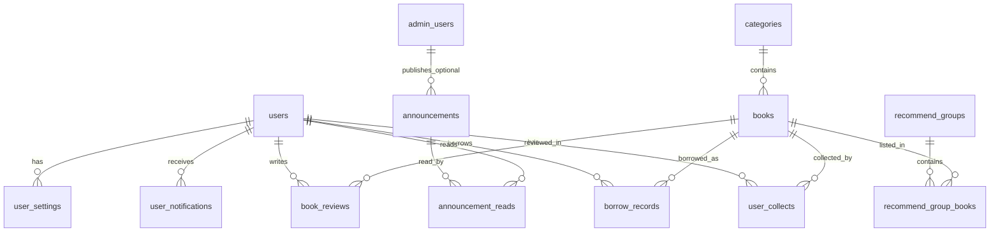

# my-book-app 数据库表结构设计（全量）

> **依据**：`README.md` 路由（用户端 + 管理端）、`docs/DEV_PLAN.md` 功能与鉴权规划、当前仓库 **Drizzle + Postgres**（`drizzle.config.ts` → `src/schema`）、已存在的测试表 `env_check`。  
> **定位**：领域建模与表级设计说明，便于评审与生成 Drizzle schema；**不替代**具体迁移文件（落地时以 `drizzle-kit generate` 为准）。

---

## 1. 设计原则

1. **主键**：业务表统一 `bigserial` 或 `uuid`；下文默认 **`bigserial`**，与现有 `env_check` 一致。  
2. **时间**：带时区 `timestamptz`，字段名 `created_at` / `updated_at` / `deleted_at`（软删按需）。  
3. **命名**：数据库层 **snake_case**；Drizzle 中可用 `camelCase` 属性映射到 snake 列名。  
4. **用户与管理端分离**：普通用户与管理员分表（`/user/login` 与 `/admin/login` 隔离，权限清晰、密钥泄露面更小）。  
5. **资源归属**：收藏、借阅、个人通知等必须带 `user_id`，接口层校验「只能操作自己的行」。  
6. **扩展**：书评审核状态、借阅状态等用 **枚举或 check + text**，避免魔法字符串散落。

---

## 2. 模块与表总览

| 模块 | 表名 | 支撑能力 |
|------|------|----------|
| 系统/联调 | `env_check` | 已有：环境探针 |
| 鉴权与用户 | `users` | 用户注册/登录、资料、角色（默认 user） |
| 鉴权与管理 | `admin_users` | 管理员账号、角色、启用状态 |
| 鉴权（可选） | `user_sessions` | 服务端会话吊销、多设备（若不用纯 JWT） |
| 图书域 | `categories` | 分类管理 `/admin/category` |
| 图书域 | `books` | 图书管理、列表、详情、库存 |
| 用户行为 | `user_collects` | 收藏 `/user/collect` |
| 用户行为 | `borrow_records` | 借阅 `/user/borrow`、`/admin/borrow` |
| 内容运营 | `announcements` | 公告 `/admin/notice`，用户端可看列表 |
| 内容运营 | `banners` | 轮播 `/admin/banner` |
| 内容运营 | `recommend_groups` + `recommend_group_books` | 推荐位 `/user/recommend`、`/admin/recommend` |
| UGC | `book_reviews` | 书评与审核 `/admin/review`，详情页展示 |
| 消息 | `user_notifications` | 用户通知 `/user/notice`（站内信） |
| 消息（可选） | `announcement_reads` | 公告已读红点（按需） |
| 用户设置 | `user_settings` | 设置 `/user/setting`（JSON 或键值） |
| 登录（可选） | `login_otp_challenges` | 手机验证码登录（短期、可清理） |

---

## 3. ER 关系（概念）

---

## 4. 枚举与字典（建议在 DB 层约束）

以下可用 Postgres `enum` 类型，或用 `text` + 应用层 Zod 枚举（Drizzle 二者皆可）。

| 名称 | 取值 | 使用表 |
|------|------|--------|
| `user_status` | `active`, `disabled` | `users` |
| `user_role` | `user`（预留扩展，默认普通用户） | `users` |
| `admin_role` | `super_admin`, `editor` | `admin_users` |
| `admin_status` | `active`, `disabled` | `admin_users` |
| `book_status` | `draft`, `on_sale`, `off_sale` | `books` |
| `borrow_status` | `borrowed`, `returned`, `overdue`, `cancelled` | `borrow_records` |
| `review_status` | `pending`, `approved`, `rejected` | `book_reviews` |
| `announcement_status` | `draft`, `published`, `archived` | `announcements` |
| `banner_status` | `active`, `inactive` | `banners` |
| `notification_type` | `system`, `borrow`, `announcement`, `review` | `user_notifications` |

---

## 5. 各表字段设计

### 5.1 `env_check`（已存在）

| 列名 | 类型 | 约束 | 说明 |
|------|------|------|------|
| `id` | `bigserial` | PK | |
| `env` | `text` | not null | 环境标识字符串 |
| `created_at` | `timestamptz` | not null, default now | |

**索引**：无额外要求；可按 `created_at desc` 做列表查询。

---

### 5.2 `users`（C 端用户）

支撑：`/user/login`、`/user/register`、`/user/setting`、所有「我的」数据外键。

| 列名 | 类型 | 约束 | 说明 |
|------|------|------|------|
| `id` | `bigserial` | PK | |
| `phone` | `varchar(20)` | unique, not null | 大陆手机为主账号时可 11 位；留余量兼容区号 |
| `password_hash` | `text` | nullable | 密码注册时存；纯验证码登录可为 null |
| `nickname` | `varchar(64)` | nullable | 展示名 |
| `avatar_url` | `text` | nullable | 头像 |
| `role` | `text` | not null, default `'user'` | 与 DEV_PLAN 一致时可存 `user`；若管理员仅走 `admin_users` 则本列恒为 user |
| `status` | `text` | not null, default `'active'` | `active` / `disabled` |
| `last_login_at` | `timestamptz` | nullable | 运营/风控 |
| `created_at` | `timestamptz` | not null, default now | |
| `updated_at` | `timestamptz` | not null, default now | 应用层或 trigger 更新 |

**索引**：

- `uq_users_phone`：`phone` unique（即表约束）。  
- `idx_users_status`：`(status)` 管理端筛选。

---

### 5.3 `admin_users`（管理端账号）

支撑：`/admin/login`、`/admin/user`（若「用户管理」仅管 C 端用户，本表供管理员登录；若还要管「管理员同事」可另加 `admin_user_invites`，此处从简）。

| 列名 | 类型 | 约束 | 说明 |
|------|------|------|------|
| `id` | `bigserial` | PK | |
| `username` | `varchar(64)` | unique, not null | 登录名 |
| `password_hash` | `text` | not null | |
| `display_name` | `varchar(64)` | nullable | |
| `role` | `text` | not null, default `'editor'` | `super_admin` / `editor` |
| `status` | `text` | not null, default `'active'` | |
| `created_at` | `timestamptz` | not null, default now | |
| `updated_at` | `timestamptz` | not null, default now | |

**索引**：`username` unique。

---

### 5.4 `user_sessions`（可选）

当采用 **服务端 Session**（Cookie 只存 session id）时使用；若采用 **无状态 JWT** 且无需吊销列表，可省略本表。

| 列名 | 类型 | 约束 | 说明 |
|------|------|------|------|
| `id` | `uuid` | PK, default gen_random_uuid() | |
| `user_id` | `bigint` | FK → `users.id`, not null | |
| `token_hash` | `text` | not null | 仅存哈希，不存明文 refresh |
| `user_agent` | `text` | nullable | |
| `ip` | `varchar(45)` | nullable | IPv6 长度 |
| `expires_at` | `timestamptz` | not null | |
| `revoked_at` | `timestamptz` | nullable | 登出/风控吊销 |
| `created_at` | `timestamptz` | not null, default now | |

**索引**：`idx_user_sessions_user_id`；`idx_user_sessions_expires_at`（定时清理）。

---

### 5.5 `categories`

支撑：`/admin/category`、图书筛选。

| 列名 | 类型 | 约束 | 说明 |
|------|------|------|------|
| `id` | `bigserial` | PK | |
| `name` | `varchar(64)` | not null | 分类名 |
| `slug` | `varchar(64)` | unique, nullable | URL 友好标识，可空 |
| `parent_id` | `bigint` | FK → `categories.id`, nullable | 二级分类 |
| `sort_order` | `int` | not null, default 0 | 越小越靠前 |
| `created_at` | `timestamptz` | not null, default now | |
| `updated_at` | `timestamptz` | not null, default now | |

**索引**：`idx_categories_parent_id`。

---

### 5.6 `books`

支撑：`/user/books`、`/user/books/[id]`、`/admin/book`、库存与借阅。

| 列名 | 类型 | 约束 | 说明 |
|------|------|------|------|
| `id` | `bigserial` | PK | |
| `category_id` | `bigint` | FK → `categories.id`, not null | |
| `title` | `varchar(255)` | not null | |
| `author` | `varchar(255)` | nullable | |
| `isbn` | `varchar(32)` | nullable | 可 unique 若业务唯一 |
| `publisher` | `varchar(128)` | nullable | |
| `published_date` | `date` | nullable | 出版日期 |
| `cover_url` | `text` | nullable | 封面 |
| `summary` | `text` | nullable | 简介 |
| `total_copies` | `int` | not null, default 0 | 馆藏总册 |
| `available_copies` | `int` | not null, default 0 | 可借册数；借阅成功 `-1`，归还 `+1` |
| `status` | `text` | not null, default `'on_sale'` | `draft` / `on_sale` / `off_sale` |
| `created_at` | `timestamptz` | not null, default now | |
| `updated_at` | `timestamptz` | not null, default now | |

**约束建议**：`available_copies >= 0`，`available_copies <= total_copies`（可用 check）。  
**索引**：`idx_books_category_id`；`idx_books_status`；全文检索可后续加 `tsvector` 或专用搜索引擎。

---

### 5.7 `user_collects`（收藏）

支撑：`/user/collect`、详情页「收藏」。

| 列名 | 类型 | 约束 | 说明 |
|------|------|------|------|
| `user_id` | `bigint` | FK → `users.id`, not null | |
| `book_id` | `bigint` | FK → `books.id`, not null | |
| `created_at` | `timestamptz` | not null, default now | |

**主键**：`(user_id, book_id)` composite PK。  
**索引**：`idx_user_collects_book_id`（管理端统计可选）。

---

### 5.8 `borrow_records`（借阅）

支撑：`/user/borrow`、`/admin/borrow`。

| 列名 | 类型 | 约束 | 说明 |
|------|------|------|------|
| `id` | `bigserial` | PK | |
| `user_id` | `bigint` | FK → `users.id`, not null | |
| `book_id` | `bigint` | FK → `books.id`, not null | |
| `borrowed_at` | `timestamptz` | not null, default now | 借出时间 |
| `due_at` | `timestamptz` | not null | 应还时间 |
| `returned_at` | `timestamptz` | nullable | 实际归还 |
| `status` | `text` | not null | `borrowed` / `returned` / `overdue` / `cancelled` |
| `remark` | `text` | nullable | 管理员备注 |
| `created_at` | `timestamptz` | not null, default now | |
| `updated_at` | `timestamptz` | not null, default now | |

**索引**：`idx_borrow_records_user_id`；`idx_borrow_records_book_id`；`idx_borrow_records_status`。

**业务规则（应用层）**：创建借阅时 `books.available_copies` 减 1；归还时加 1；逾期可由定时任务把 `borrowed` 且 `now() > due_at` 更新为 `overdue`。

---

### 5.9 `announcements`（公告）

支撑：`/admin/notice`；用户端首页或 `/user/notice` 中「公告」区块（与站内信区分见下节）。

| 列名 | 类型 | 约束 | 说明 |
|------|------|------|------|
| `id` | `bigserial` | PK | |
| `title` | `varchar(255)` | not null | |
| `body` | `text` | not null | 富文本可存 HTML/Markdown |
| `status` | `text` | not null, default `'draft'` | |
| `published_at` | `timestamptz` | nullable | 定时发布 |
| `publisher_admin_id` | `bigint` | FK → `admin_users.id`, nullable | |
| `created_at` | `timestamptz` | not null, default now | |
| `updated_at` | `timestamptz` | not null, default now | |

**索引**：`idx_announcements_status_published_at`。

---

### 5.10 `announcement_reads`（可选）

支撑：公告已读、红点；若不做已读可删此表。

| 列名 | 类型 | 约束 | 说明 |
|------|------|------|------|
| `user_id` | `bigint` | FK → `users.id`, not null | |
| `announcement_id` | `bigint` | FK → `announcements.id`, not null | |
| `read_at` | `timestamptz` | not null, default now | |

**主键**：`(user_id, announcement_id)`。

---

### 5.11 `banners`（轮播图）

支撑：`/admin/banner`；用户端首页轮播。

| 列名 | 类型 | 约束 | 说明 |
|------|------|------|------|
| `id` | `bigserial` | PK | |
| `image_url` | `text` | not null | |
| `title` | `varchar(128)` | nullable | |
| `link_url` | `text` | nullable | 点击跳转 |
| `sort_order` | `int` | not null, default 0 | |
| `status` | `text` | not null, default `'active'` | |
| `start_at` | `timestamptz` | nullable | 投放开始 |
| `end_at` | `timestamptz` | nullable | 投放结束 |
| `created_at` | `timestamptz` | not null, default now | |
| `updated_at` | `timestamptz` | not null, default now | |

**索引**：`idx_banners_status_sort`。

---

### 5.12 `recommend_groups` + `recommend_group_books` 暂不实现

支撑：`/admin/recommend`、`/user/recommend`（一组书为一个推荐位/专题）。

**`recommend_groups`**

| 列名 | 类型 | 约束 | 说明 |
|------|------|------|------|
| `id` | `bigserial` | PK | |
| `name` | `varchar(128)` | not null | 如「本周必读」 |
| `description` | `text` | nullable | |
| `sort_order` | `int` | not null, default 0 | 多组排序 |
| `status` | `text` | not null, default `'active'` | |
| `created_at` | `timestamptz` | not null, default now | |
| `updated_at` | `timestamptz` | not null, default now | |

**`recommend_group_books`**

| 列名 | 类型 | 约束 | 说明 |
|------|------|------|------|
| `group_id` | `bigint` | FK → `recommend_groups.id`, not null | |
| `book_id` | `bigint` | FK → `books.id`, not null | |
| `sort_order` | `int` | not null, default 0 | 组内顺序 |

**主键**：`(group_id, book_id)`。

---

### 5.13 `book_reviews`（书评 + 审核）

支撑：`/admin/review`、图书详情页展示已通过书评。

| 列名 | 类型 | 约束 | 说明 |
|------|------|------|------|
| `id` | `bigserial` | PK | |
| `user_id` | `bigint` | FK → `users.id`, not null | |
| `book_id` | `bigint` | FK → `books.id`, not null | |
| `rating` | `smallint` | not null | 如 1–5 |
| `content` | `text` | not null | |
| `status` | `text` | not null, default `'pending'` | |
| `reject_reason` | `text` | nullable | 驳回原因（用户可见与否由产品定） |
| `moderator_admin_id` | `bigint` | FK → `admin_users.id`, nullable | |
| `moderated_at` | `timestamptz` | nullable | |
| `created_at` | `timestamptz` | not null, default now | |
| `updated_at` | `timestamptz` | not null, default now | |

**索引**：`idx_book_reviews_book_status`；`idx_book_reviews_user_id`。  
**约束**：`rating between 1 and 5`（check）。

---

### 5.14 `user_notifications`（用户通知 / 站内信） 暂不实现

支撑：`/user/notice`；与 **公告** 区分：公告偏运营一条多受众；通知偏 **个人**（借阅即将到期、审核结果等）。

| 列名 | 类型 | 约束 | 说明 |
|------|------|------|------|
| `id` | `bigserial` | PK | |
| `user_id` | `bigint` | FK → `users.id`, not null | |
| `type` | `text` | not null | 见枚举 `notification_type` |
| `title` | `varchar(255)` | not null | |
| `body` | `text` | nullable | |
| `link_url` | `text` | nullable | 跳转详情 |
| `read_at` | `timestamptz` | nullable | null 表示未读 |
| `created_at` | `timestamptz` | not null, default now | |

**索引**：`idx_user_notifications_user_read` `(user_id, read_at nulls first)` 或 `(user_id, created_at desc)`。

---

### 5.15 `user_settings`（用户设置） 暂不实现

支撑：`/user/setting`；单表 JSON 一行 per user 简单，或键值扩展；此处推荐 **每用户一行 JSONB**。

| 列名 | 类型 | 约束 | 说明 |
|------|------|------|------|
| `user_id` | `bigint` | PK, FK → `users.id` | |
| `settings` | `jsonb` | not null, default '{}'` | 主题、通知开关、语言等 |
| `updated_at` | `timestamptz` | not null, default now | |

---

### 5.16 `login_otp_challenges`（可选，手机验证码）暂不实现

支撑：`docs/手机号验证码登录-学习与实现流程.md`；若 OTP 仅放 Redis 可不要此表。落库时建议 **只存 hash**，与密码同理。

| 列名 | 类型 | 约束 | 说明 |
|------|------|------|------|
| `id` | `bigserial` | PK | |
| `phone` | `varchar(20)` | not null | |
| `code_hash` | `text` | not null | |
| `expires_at` | `timestamptz` | not null | |
| `attempts` | `int` | not null, default 0 | |
| `created_at` | `timestamptz` | not null, default now | |

**索引**：`idx_login_otp_phone_created` `(phone, created_at desc)`；定期删除过期行。

---

## 6. 管理端数据看板（`/admin/dataview`）

可不建独立表，由 **聚合查询** 提供：用户数、图书数、借阅中笔数、今日归还、待审核书评数等。若需 **固化日报**，可后续增加 `daily_stats` 物化视图或 `admin_stat_snapshots` 表（本设计从简省略）。

---

## 7. 与当前仓库路径的对应

| 项 | 路径 |
|----|------|
| Drizzle schema 目录 | `src/schema/`（与 `drizzle.config.ts` 中 `schema: "./src/schema"` 一致） |
| 已有表示例 | `src/schema/env-check.ts` → 表 `env_check` |
| 规划文档 | `docs/DEV_PLAN.md` |

若团队后续把 schema 迁到 `src/db/schema/`，需同步修改 `drizzle.config.ts` 的 `schema` 路径。

---

## 8. 落地顺序建议（迁移）

1. `users`、`admin_users`  
2. `categories`、`books`  
3. `user_collects`、`borrow_records`  
4. `announcements`（+ 可选 `announcement_reads`）  
5. `banners`、`recommend_groups`、`recommend_group_books`  
6. `book_reviews`  
7. `user_notifications`、`user_settings`  
8. 可选：`user_sessions`、`login_otp_challenges`

---

## 9. 版本说明

- **v1**：覆盖 README / DEV_PLAN 所列页面所需核心实体。  
- 后续可增：**图书标签多对多**、**借阅罚款**、**操作审计 `admin_audit_logs`**、**文件对象表**（统一存 OSS key）等。
